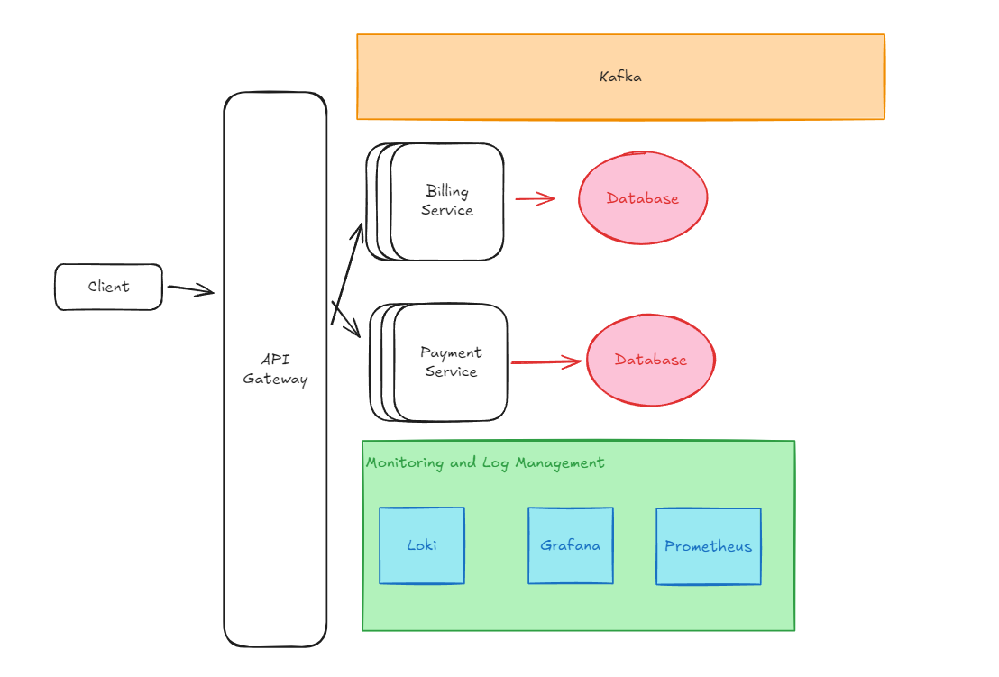
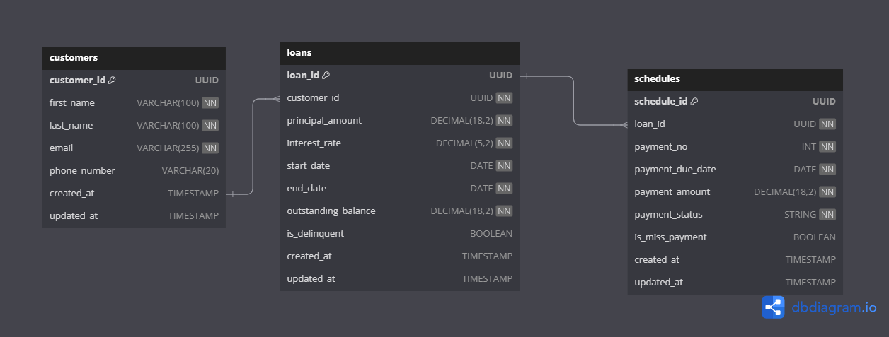
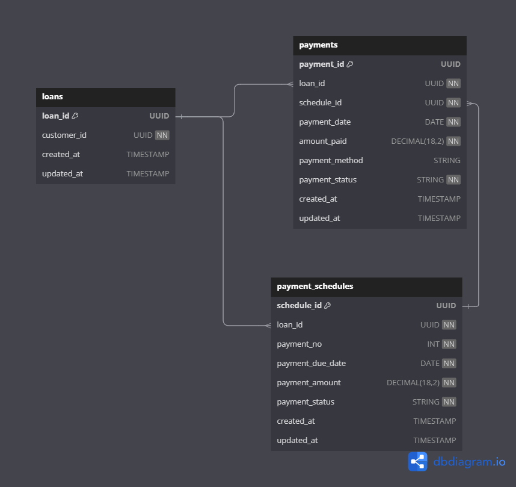

# Amartha Backend Engineer Technical Test - Example 1
## Billing Engine

### Scope:
The primary objective of this project is to develop a robust billing engine specifically designed for managing loans and handling (re)payments. The focus is on creating a system that efficiently manages the following functionalities:

- **Loan Creation**: Enable the creation of loan records with all necessary details, including principal, interest rate, and payment terms.

- **Outstanding Balance Calculation**: Provide real-time calculation of outstanding balances for each loan, reflecting any payments made or missed.

- **Payment Schedule Generation**: Automatically generate a payment schedule that outlines due dates and amounts for each installment.

- **Delinquency Status Determination**: Implement a mechanism to assess and determine if a customer is delinquent by tracking missed payments.

- **Payment Processing**: Facilitate the process of making payments, updating loan records, and adjusting outstanding balances accordingly.

### Out of Scope:
The following functionalities are considered out of scope for this project:

- **User Authentication**: The system will not include user authentication mechanisms, as the focus is on the billing engine itself.
- **Frontend Interface**: The project will not include a frontend interface, as the primary goal is to develop the backend logic.
- **Payment Gateway** Integration: The system will not integrate with any payment gateways, as the focus is on the billing engine's core functionalities and just mock the payment processing.
- **Interest Calculation**: The system will not include complex interest calculation logic, as the focus is on the core billing engine functionalities.
- **Reporting**: The project will not include reporting functionalities, as the primary goal is to develop the backend logic.
- **Notifications**: The system will not include notification mechanisms, as the focus is on the billing engine itself.
- **Multi-Tenancy**: The system will not support multi-tenancy, as the focus is on the core billing engine functionalities.
- **User Profile**: The system will not include complex user profile management, and will just have a customer_id, customer_name, and customer_email.  
- **Database Migration** : The system will not include complex database migration with version, it will just use basic migration using GORM. 

### Tech Stack
- Language: Golang
- Framework: Echo
- Database: PostgreSQL
- ORM: GORM
- Testing: Ginkgo & Gomega
- Mocking: GoMock
- Deployment: Docker (Compose) & Kubernetes
- Logging: Zerolog
- Monitoring: Prometheus & Grafana
- Log Management: Loki

### System Design

## Database Schema - Billing Service

## Database Schema - Payment Service

